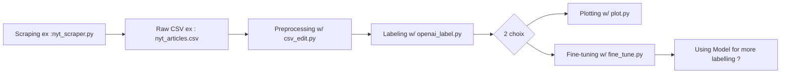
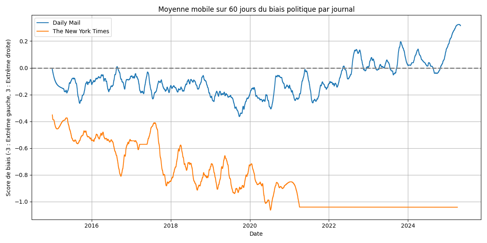
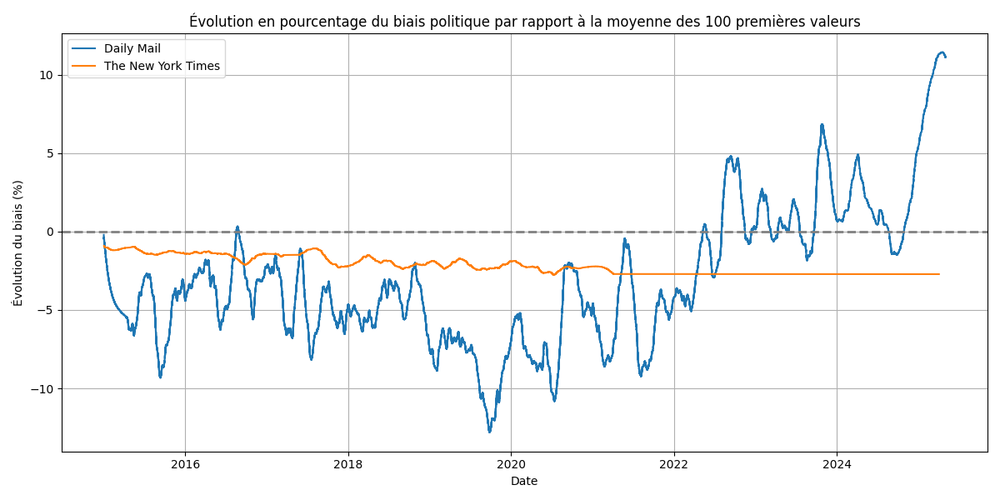

# Code pour le Cassiopée de Aylal Baha et Melvil Hamon 2025

Ce dépot contient les codes utilisés pour notre projet Cassiopée.

## Structure du dossier

```
codes/
├── scrapers
├───── 20 minutes_scraper.py
├───── dailymail_scraper.py
├───── lemonde_scraper.py
├───── nyt_scraper.py
├── csv_edit.py
├── fine_tune.py
├── openai_label.py
├── plot.py
└── README.md
```

**On discerne deux groupes de codes:**

**Scraping**

Sur les journaux choisis entre 2015 et 2025.
La plupart de ces codes suivent un format similaire notamment entre Le Monde, Daily Mail et 20 Minutes.
Le principe de ces 3 codes est simple, on utilise un driver de navigateur (Firefox (geckodriver) ou Chromium) pour accéder au code HTML des pages voulus.
Pour chaque date entre 2015 et 2025, on accède aux archives des journaux qui sont offerts directement sur leur page internet et on liste les articles dans ces archives.
On selectionne ensuite 10 articles et on récupère leur titre,date,description et contenu afin de les sauvegarder dans un fichier CSV contenant nos données récoltés.
Pour cela, nous utilisons Selenium pour diriger les drivers de navigateurs et Beautiful Soup pour récupérer et traiter nos HTML.
Selenium permet d'utiliser les drivers de façon discrète afin que les sites ne détectent pas et ne bloquent pas l'accès.

Pour le New York Times, la tâche est plus délicate. Les archives sont encore présentes et bien fournis mais l'accès au site est régulé pour empêcher le scraping des articles.
Il a donc fallu trouver une autre méthode que juste Selenium.
Pour cela, beaucoup de solutions ont été envisagés, modifier les paramètres de discrétions du navigateur notamment en changeant fréquemment les UserAgent qui permettent aux sites de récolter des informations sur le navigateur du client.
Mais même avec de nombreuses techniques, le site détecte notre présence au bout de 20 à 30 articles scrappés.
Il a fallu trouver une autre méthode de discrétion et si possible sans dépenser de l'argent pour un proxy privé.
J'ai alors eu l'idée d'utiliser mon téléphone portable comme hotspot internet et utiliser ADB l'interface entre les ordinateurs et ordinateur pour commander un changement d'adresse IP lorsque le navigateur tombe sur un Captcha.
Cette technique est très efficace mais cela ralentit le scraping et nécessite un téléphone branché en permanence.

Pour les Échos, le problème est différent. Les archives des Échos sont vides depuis 2020 et sont incomplètes entre 2018 et 2020.
On a donc premièrement effectué un scraping entre 2015 et 2018 en utilisant la même méthode que pour les premiers journaux et il a fallu trouver une méthode pour le reste.
Nous avons alors penser à utiliser Web Archive Wayback Machine, qui permet de consulter des captures de sites archivées. Le programme va alors chercher la une du journal pour une certaine date et récupère les articles de ce jour là.
Wayback Machine a été une bonne solution mais possède des défauts, ce site est premièrement très lent, ne possède pas des captures pour chaque jour entre 2018 et 2025 et se trouve être assez instable.
Il y a donc certains jours qui n'ont pas pu être récupéré et le scraping s'est avéré long et fastidieux.


**Traitement des données :**

### `csv_edit.py`
Cet utilitaire permet de supprimer les doublons se trouvant dans les fichiers CSV récupéré, il permet également de donner un fichier contenant le nombre d'articles scrapés par jour, ce qui est particulièrement utile pour noter les "trous" dans notre scraping et y remédier.
On peut aussi afficher des graphiques avec le nombre d'articles scrapés en fonction des jours ou mois.
On ajoute également un utilitaire pour transformer les dates en français récupérés sur le Monde en date YYYY-MM-DD, plus simple pour un traitement ultérieur.

### `fine_tune.py`
Ce script en cours d'écriture permet d'entrainer un modèle de classification NLP pour, si réussite, créer un modèle nous permettant de classifier le biais de chaques articles (anglais ou français) sans passer par un modèle couteux de LLM comme ChatGPT. On pourrait alors réaliser une pipeline simple de scraping et de labellisation qui nous permetterait un scaling de notre projet.

### `openai_label.py`
Étant donné que le fine tuning n'a toujours pas montré des résultats concluants, on doit passer par un api OpenAI pour labelliser nos datasets grâce aux modèles d'OpenAI notamment GPT-4.1-mini qui montre les meilleurs résultats (observés articles par articles) pour le meilleur prix.
Grâce à cette labellisation, nous pouvons récupérer des données utiles qui peuvent être grapher ou utiliser pour fine tuner le modèle NLP.

### `plot.py`
Ce script permet simplement d'afficher l'évolution des biais des articles pour chaque journal, il suffit juste d'avoir au préalable labelliser le jeu de données.
On effectue une moyenne glissante et un filtrage Savitzky-Golay pour lisser nos courbes (qui sont très affectés par le bruit) afin d'obtenir les résultats voulus.

---
N'hésitez pas à consulter chaque script pour plus de détails sur leur fonctionnement et leurs paramètres d'utilisation.


### Pipeline du Projet



### Résultats

Quelques Résultats préliminaires :


